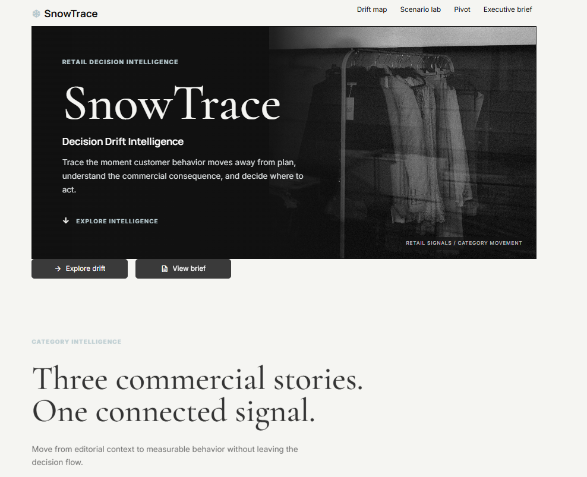
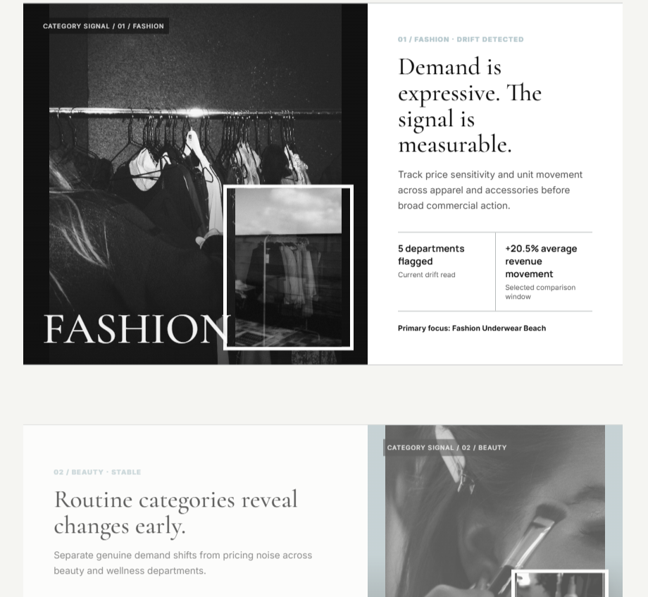
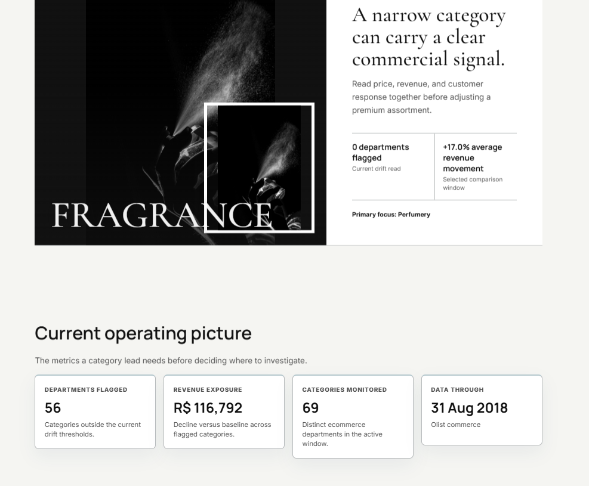

# SnowTrace



SnowTrace is a Decision Drift Intelligence application for examining how retail category performance changes between two business periods. It turns order, price, revenue, review, and delivery signals into category-level drift alerts, scenario comparisons, exploratory pivots, and an executive brief.

The application uses the Brazilian E-Commerce Public Dataset by Olist. It can query Snowflake with Snowpark when an active Snowflake session is available, build the same analytical summary from local Olist CSV files, or use a committed processed sample for a credential-free demonstration.

## Overview

Retail performance rarely changes through one metric alone. A category can gain revenue while losing units, hold volume while price moves sharply, or show customer-experience deterioration before sales decline. SnowTrace compares a baseline period with a current period and brings these signals into one business-facing workflow.

The application is organized around four questions:

- Where is behavior moving away from the baseline?
- What might happen if the business changes price?
- How can the same signal be regrouped for analysis?
- What should be summarized for a decision-maker?

## Key Features

- Multi-page Streamlit workspace with shared date filters and navigation.
- Category drift analysis across revenue, unit volume, average price, review score, and delivery time.
- Division filtering, KPI summaries, readable horizontal category charts, and priority-ranked recommendations.
- Directional price-action scenarios with session-level saved comparisons.
- Configurable pivot exploration by grouping and metric.
- Downloadable Markdown executive brief and CSV export from Streamlit data tables.
- Snowflake/Snowpark query path, local Olist processing path, and processed sample fallback.
- Five-minute query-result caching and session caching for the Snowpark resource.
- Responsive editorial category views for Fashion, Beauty, and Fragrance.

## Architecture

```text
Olist CSV files                          Snowflake RAW tables
       |                                       |
       v                                       v
Pandas order fact                    SQL/Snowpark query
       |                                       |
       +----------- period aggregation --------+
                              |
                              v
                    Drift summary DataFrame
                              |
                              v
         Streamlit pages, Plotly chart, tables, scenarios,
                    recommendations, and brief
```

`app/lib/data.py` owns data access and transformation. `load_drift_summary()` selects the best available source in this order:

1. Active Snowflake Snowpark session.
2. Required Olist CSV files under `data/raw/`.
3. `data/drift_summary_sample.csv`.

The resulting schema is shared by every page, so the interface behaves consistently regardless of the available source.

## Decision Drift Logic

SnowTrace calculates percentage movement between the baseline and comparison periods. A category is marked `DRIFT` when both periods contain volume and at least one threshold is crossed:

- absolute average price change is at least 8%;
- absolute unit-volume change is at least 18%;
- absolute revenue change is at least 20%; or
- absolute review-score change is at least 0.4 points.

If either period is missing, the category is marked `INSUFFICIENT_DATA`. Otherwise it is `STABLE`.

Confidence is based on combined baseline and comparison volume: `High` at 400 or more items, `Medium` at 120 or more, and `Directional` below 120. Severity is the sum of the absolute price, volume, and revenue percentage changes, ranked within each division. Revenue exposure is the positive shortfall between baseline and current revenue for flagged categories.

These thresholds are currently defined in code and SQL rather than exposed as user-editable settings.

## Data Processing

The local Pandas path:

- loads orders, items, products, category translations, and reviews;
- removes duplicate order-item, product, and translation keys;
- joins the datasets into an order-level analytical fact;
- retains delivered, shipped, and invoiced orders;
- calculates item revenue and delivery duration;
- aggregates both selected periods by division and department;
- calculates KPI changes, drift status, confidence, severity rank, explanations, and recommended actions.

The processed sample is committed so the application remains usable without raw Kaggle files or credentials. Raw Olist files are ignored because they are large source artifacts.

## Snowflake Implementation

`sql/01_setup.sql` creates the `SNOWTRACE_WH` warehouse, `SNOWTRACE` database, `RAW` and `ANALYTICS` schemas, raw Olist tables, category mapping, and three analytical views:

- `ANALYTICS.ORDER_FACT`
- `ANALYTICS.CATEGORY_MONTHLY_METRICS`
- `ANALYTICS.DRIFT_SUMMARY`

At runtime, `get_snowpark_session()` requests the active Snowflake session. `_query_snowflake()` runs parameterized SQL through `session.sql(..., params=...)`, applies the selected date windows, and returns a Pandas DataFrame for Streamlit. Query failures fall back to the local data path without exposing credentials.

The current connection approach is designed for an environment that supplies an active Snowpark session, such as Streamlit in Snowflake. The repository does not read account passwords or private keys.

## Analytics and User Flow

1. Open the home page to understand the current category context.
2. Use **Where Behavior Shifts** to choose a division, review KPIs, inspect the largest category movements, and switch between priority and complete readouts.
3. Use **What If We Act** to apply a directional price change and save comparisons during the current session.
4. Use **Pivot Builder** to change the grouping and analytical measure.
5. Use **Executive Brief** to review priority actions and download the full summary as Markdown.

The price scenario is a directional planning calculation. It applies the proposed percentage change to current volume and average price; it is not a demand-elasticity or forecasting model.

## Tech Stack

- Snowflake and Snowpark Python
- SQL
- Python
- Streamlit
- Pandas
- Plotly
- Python `unittest`

## Project Structure

```text
app/
  Home.py
  lib/
    data.py
    theme.py
  pages/
    1_Where_Behavior_Shifts.py
    2_What_If_We_Act.py
    3_Pivot_Builder.py
    4_Executive_Brief.py
  static/images/
data/
  drift_summary_sample.csv
sql/
  01_setup.sql
tests/
  test_data_logic.py
.streamlit/
  config.toml
requirements.txt
```

## Running Locally

```powershell
git clone https://github.com/25nehasinhaa/SnowTrace.git
cd SnowTrace
python -m venv .venv
.venv\Scripts\Activate.ps1
python -m pip install -r requirements.txt
streamlit run app/Home.py
```

The committed processed sample is sufficient for local use. To rebuild analytics from the Olist source, place these files in `data/raw/`:

```text
olist_orders_dataset.csv
olist_order_items_dataset.csv
olist_products_dataset.csv
olist_order_reviews_dataset.csv
product_category_name_translation.csv
```

## Snowflake Setup

1. Run `sql/01_setup.sql` in a Snowflake worksheet.
2. Load the Olist CSV files into the matching `RAW` tables.
3. Confirm `ANALYTICS.ORDER_FACT` and `ANALYTICS.DRIFT_SUMMARY` return rows.
4. Run the application where `snowflake.snowpark.context.get_active_session()` is available.

The setup script uses `CREATE OR REPLACE` and an account-administrator workflow for initial project setup. It should not be rerun as part of normal application startup. A production deployment should replace this with a least-privilege application role and controlled migrations.

## Configuration and Security

No credentials are required for the processed local sample. Snowflake credentials are not stored in this repository. `.env`, `.streamlit/secrets.toml`, raw source data, virtual environments, caches, and logs are ignored by Git.

Date parameters are bound into Snowflake SQL rather than concatenated into query text. For a hosted deployment, configure credentials or workload identity in the platform secret store and grant access only to the required warehouse, database, and schema.

## Testing

Run the data-logic tests with the standard library test runner:

```powershell
.venv\Scripts\python.exe -m unittest discover -s tests -v
```

The tests cover zero-baseline percentage handling, missing-period classification, material revenue drift, recommendation selection, and empty-period aggregation.

## Screenshots

| Category intelligence | Executive operating view |
| --- | --- |
|  |  |

## Future Improvements

- Move thresholds into governed configuration with change history.
- Add elasticity or forecasting models for scenario planning.
- Add integration tests against a dedicated Snowflake test schema.
- Introduce deployment-specific roles, migrations, monitoring, and data-quality checks.
